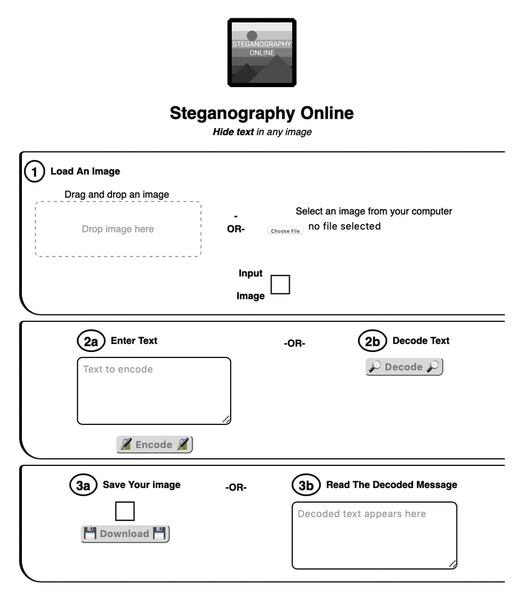

  

# Steganography Online

`Steganography Online` allows users to encode text within an image and decode that text later.

This repository contains a website that allows users to upload an image, enter text, and encode the text in the least significant digits of the image's color data. The website also allows users to decode text from an image that previously had text encoded into it. For more information on steganography check out the [Wikipedia page](https://en.wikipedia.org/wiki/Steganography) on the subject.

  

## Live Example

A live example of this website is hosted at [https://stuffjackmakes.com/steganography-online](https://stuffjackmakes.com/steganography-online).

## How it Works

Images contain one byte of data for each of the red, green, blue, and alpha channels. This website takes the least significant bit (the difference between 255 and 254) and replaces it with one bit of data from a string. Because the difference between a pixel with a red value of 255  and a pixel with a red value of 254  is essentially imperceptible, the image will look no different. Later, this information can be extracted by reading the least significant bits and putting them together again. The strings are encoded in [Base64](https://en.wikipedia.org/wiki/Base64) before being put into the image to make the number of 'coincidence' bytes (i.e. bytes that look like text, but aren't). This also means that when decoding, the program can stop once it sees a character that is not part of Base64.

## Limitations

* If your message is too long to fit in the iamge provided it may be truncated (an alert pops up to warn you).
* Very large messages or images may take some time to encode. The encoding process is blocking, which means the tab will freeze while working.
* Pixels with an alpha value below 250 are not used for encoding. This is because the RGB values of pixels with lower alpha values get truncated, which would remove any information stored there. Practially speaking, this means that images with more transparent parts can hold less information.
* You can only save images as `.png` files because they do not use lossy compression, which would erase data stored in the image.

## Setup

Host the `index.html` file with your software of choice and you're done!

## Author

Check out my other work at [stuffjackmakes.com](https://stuffjackmakes.com)